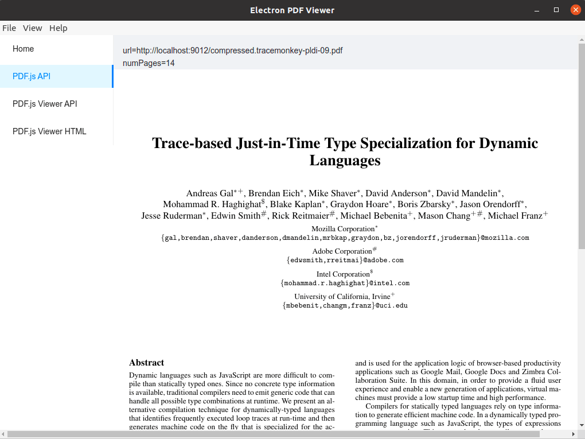

# Electron PDF.js Viewer

Demo for using PDF.js in Electron.

Uses:

- [Electron React Boilerplate](https://electron-react-boilerplate.js.org/)
  - [Electron](https://www.electronjs.org/), [React](https://reactjs.org/)
- [Ant Design](https://ant.design/)
- [PDF.js](https://mozilla.github.io/pdf.js/)

## Overview

<table style="border: none">
  <tr>
    <td style="border: none"></td>
    <td style="border: none"></td>
  </tr>
  <tr>
    <td style="border: none"></td>
    <td style="border: none"></td>
  </tr>
</table>

## Usage

## Install

```bash
git clone --branch main git@github.com:ikuokuo/electron-pdf-viewer.git
cd aireader-desktop
npm install
```

## Starting Development

Start the http static server:

```bash
# use python: static/http_server.sh
npm run static
```

Start the app in the `dev` environment:

```bash
npm start
```

## Packaging for Production

To package apps for the local platform:

```bash
npm run package
```

## Docs

- [Electron PDF.js Viewer 从零开始](https://yyixx.com/docs/render/pdfjs)

## License

MIT © [Electron React Boilerplate](https://github.com/electron-react-boilerplate)
